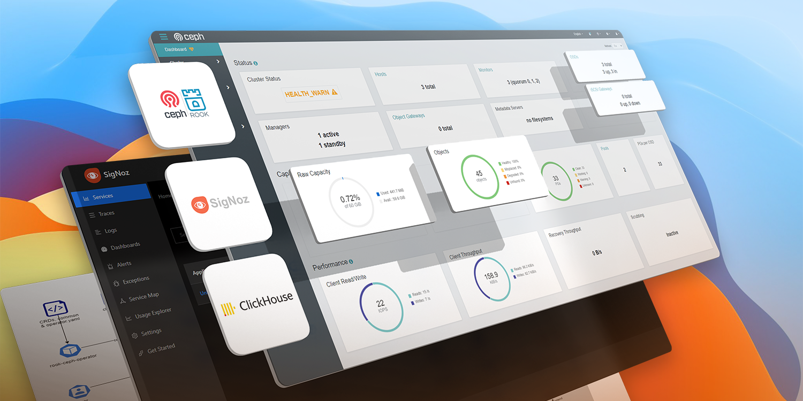

# Vagrantfile to Automate Kubernetes Setup
> The full explanation of SCR on K8s can be seen on this article : [Rook-Ceph K8s Hands-On: Study Case SigNoz + ClickHouse](https://medium.com/@theophil730730/rook-ceph-k8s-hands-on-study-case-signoz-clickhouse-fb9ad1417815)

This repos contain Vagrant Configuration and SCR (SigNoz, ClickHouse, and RookCeph) installation. 

The directory `mounted-volume` above will be mounted to the directory `/vagrant/mounted-volume` inside of each virtual machines.

---
<br><br>
# Starting the VMs

## Prerequisites
1. Working Vagrant setup
2. Computer with ≥ 8 Gb RAM & ≥ 6 core CPU
<br><br>
## For MAC/Linux Users

Latest version of Virtualbox for Mac/Linux can cause issues.

Create/edit the /etc/vbox/networks.conf file and add the following to avoid any network related issues.
<pre>* 0.0.0.0/0 ::/0</pre>
or run below commands
```shell
sudo mkdir -p /etc/vbox/
echo "* 0.0.0.0/0 ::/0" | sudo tee -a /etc/vbox/networks.conf
```
So that the host only networks can be in any range, not just 192.168.56.0/21 as described here:
https://discuss.hashicorp.com/t/vagrant-2-2-18-osx-11-6-cannot-create-private-network/30984/23

<br><br>
## Bring Up the Cluster
To provision the cluster, execute the following commands.
```shell
git clone https://github.com/theophilhenry/vm-operation-scr.git
cd vm-operation-scr.git
vagrant up
```

## Connect to the Master Node
To connect to the main VM or master node, do the following command.
```shell
vagrant ssh master
```

---
<br><br>
# Installing RookCeph, ClickHouse, and SigNoz

## Install RookCeph
The following comamnd require you to connect to the master node first.
```shell
# Make sure there's a new unformated disk in your VMs
# Then run the following
cd /vagrant/mounted-volume/rook/deploy/examples
kubectl create -f crds.yaml -f common.yaml -f operator.yamls
# Wait for The Operator state to be Running
kubectl create -f cluster.yaml
# Wait for The Cluster and OSDs to be created
cd /vagrant/mounted-volume/rook/deploy/examples/csi/rbd/
kubectl apply -f storageclass.yaml
```

## Install ClickHouse
The following comamnd require you to connect to the master node first.
```shell
cd /vagrant/mounted-volume/clickhouse
kubectl create ns clickhouse
RELEASE_NAME=clickhouse NAMESPACE=clickhouse
helm install $RELEASE_NAME ./ -f ./v-override.yaml -n $NAMESPACE
```

## Install SigNoz
The following comamnd require you to connect to the master node first.
```shell
cd /vagrant/mounted-volume/signoz
kubectl create ns signoz
RELEASE_NAME=signoz NAMESPACE=signoz
helm install $RELEASE_NAME ./ -f ./v-override.yaml -n $NAMESPACE
```

---

<br><br>
# Shut Down the VMs
## To shutdown the cluster,
```shell
vagrant halt
```

## To restart the cluster,
```shell
vagrant up
```

## To destroy the cluster,
```shell
vagrant destroy -f
```

